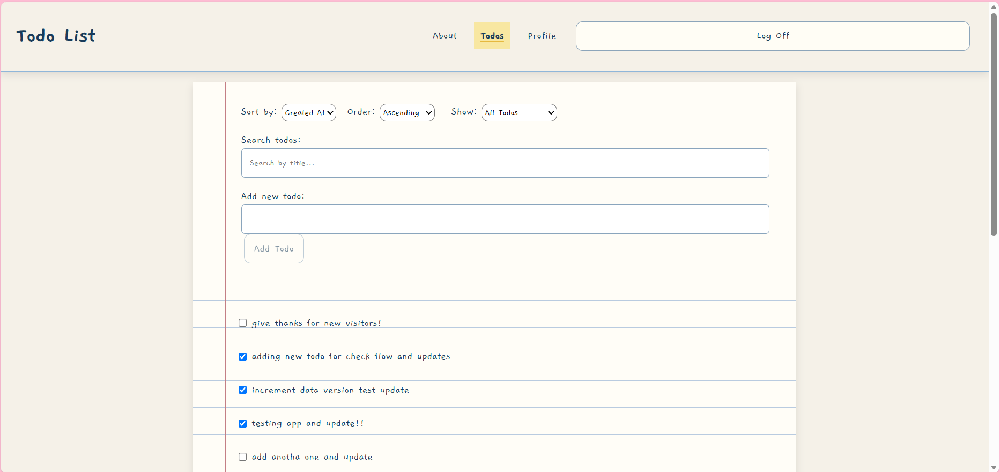
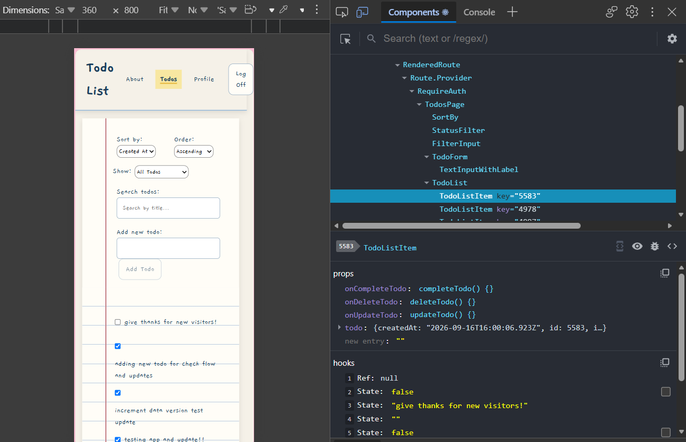

## Daniela's Todo List
Hello and welcome!

Daniela’s Todo List is a full-stack JavaScript todo application built with React. Inspired by writing todos on lined paper, it provides a clean, responsive interface for creating and managing tasks.

I created this app as my class's final project to showcase what I learned during the past 11 weeks of studying React and full-stack JavaScript development.

## Live Demo Link
Click this link to [watch me demo this app](https://youtu.be/ivI2mc1e4TM).

## Features
* Add new todo items
* Edit existing todo items
* Mark todos as complete or incomplete
* View active todo items
* Filter todos using a search/filter input
* Sort todos by selected criteria
* Authenticate users through a login page
* Protect authenticated routes
* View a user profile with todo statistics
* Navigate between pages using React Router
* Display validation and error messages
* Responsive design for desktop and mobile screens
* Accessible interactive elements with keyboard-friendly focus indicators
* Styled forms, buttons, navigation, and todo components

## Technologies Used
* React.js 19, React DOM – building the user interface with reusable components
* React Router – client-side routing and protected routes
* Vite – development server and build tooling
* ESLint - to maintain code quality and consistency accross the project
* JavaScript (ES6+) – application logic and functionality
* HTML – semantic page structure
* CSS – styling, responsive design, and interactive states
* Git & GitHub – version control and project hosting
* REST API – communicating with the application's backend

## Screenshots
### Desktop

### Mobile

## Installation & Setup
### Prerequisites: 
Before running the project locally, ensure you have
* Installed Node.js and Git
* Access to a web browser
### Installation instructions
1. Visit [project URL](https://github.com/dhblanco/react26.3-ctd-todo-list-project/)
2. Clone repository and install locally using this command in a terminal:
    * `git clone https://github.com/dhblanco/react26.3-ctd-todo-list-project/`
3. To install dependencies, run this command next: 
    * `npm install`
### How to run the development server
1. Within project root, run command
    * `npm run dev`
2. Locate URL, something like "Local: http://localhost:5173/"
3. Open URL in browser to view live app

## Available Scripts
The following npm scripts are available in the project:
| Script            | Used for...                                                                                            |
|-------------------|--------------------------------------------------------------------------------------------------------|
| `npm run dev`     | Starts the Vite development server and allows the application to be viewed locally during development. |
| `npm run build`   | Creates a production-ready build of the application.                                                   |
| `npm run lint`    | Runs ESLint to check the code.                                                                         |
| `npm run preview` | Locally previews the production build created by npm run build.                                        |

## Design Decisions
I was behind this class due to some wonky feedback from my class' AI reviewer, so I had other visions and when I was crunched for time, I remembered the basics... like an flash card generator I made as a project to apply to Code The Dream. What if I could make the todo list feel familiar, like a sheet of paper?

So for the visual design, I used CSS modules and in-line stlying to mimic the feel of a lined piece of paper or index card, and added contrasting soft colors (whites, blues, yellows, reds) to invite a notebook / school feeling. 

I'm really inspired by apps like ["Stick it with Robert"](https://stick-it-with-robert.vercel.app/), made by Arissa, a student from Singapore. It was so cool to come across this as I was starting class with CTD and then to learn the React project would be a todo list. This was a great way to practice mimicking that cozy paper/real-life feel!

I organized the header, navigation, authentication controls, and todo controls near the top of the page, keeping the todos on the lined-paper surface below. This creates visual contrast and reinforces the notebook-inspired concept.

Accessibility was also considered in the design. Form controls use associated labels, error messages are communicated to users, and interactive elements include visible focus states for keyboard navigation. Super cool to see the feedback as you tab across the screen!

## Future improvements
In time, I would like to:
* Improve styling consistency, visual/spacing polish, and minor code cleanup.
* Add movable sticky notes alongside the filter and sort controls.
* Refine the mobile layout and responsive styling.
* Add more visual feedback and subtle animations where appropriate.
* Explore additional ways to personalize the paper and notebook-inspired design.
* Implement these changes to deploy and version 1 of a soon to be more polished app!

## License Information
This project is licensed under the [MIT License](LICENSE) - see the [LICENSE](LICENSE) file for details.

Copyright (c) 2026 DANIELA HERNáNDEZ BLANCO

## Contact Information
Github: [@dhblanco](https://github.com/dhblanco)

## About the author 
I am a student from Costa Rica learning programming through Code The Dream (CTD), a nonprofit organization based in Durham, NC. I hope to share my skills with community members in need of service and can connect in ways that help us keep dreaming and creating a life we can enjoy. 
